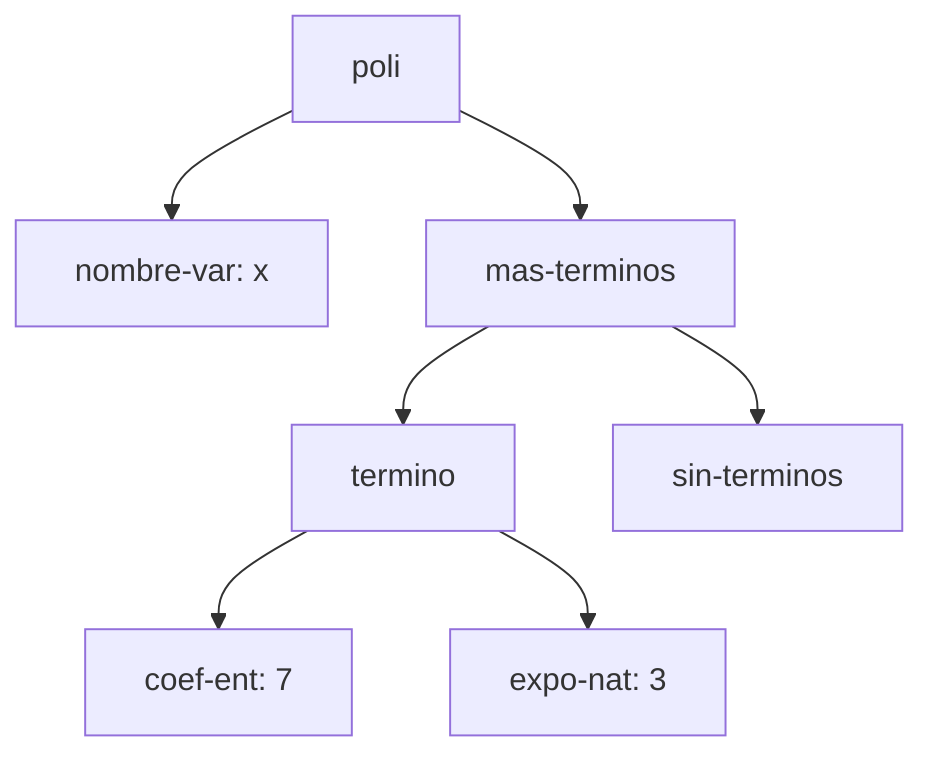
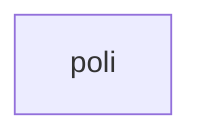

# Informe de AST — Taller 1: polinomios dispersos

> **Plantilla de entrega.** Copie este archivo a `docs/informe-ast.md`
> dentro del repositorio del grupo y reemplace los marcadores
> `{{...}}` con su contenido. **No elimine las secciones
> obligatorias.** No se aceptan PDF, DOCX ni imágenes insertadas:
> todo el documento debe ser Markdown, las fórmulas en LaTeX
> (`$...$` / `$$...$$`) y los diagramas en Mermaid.
>
> Este taller no pide traza de evaluación ni cadena de ambientes; el
> intérprete llega en el Taller 2.

**Curso:** Fundamentos de Interpretación y Compilación de Lenguajes
de Programación — Universidad del Valle, Sede Tuluá.

**Integrantes del grupo:**

| Nombre | Código | Correo institucional |
|--------|--------|----------------------|
| {{Nombre 1}} | {{Código 1}} | {{correo1@correounivalle.edu.co}} |
| {{Nombre 2}} | {{Código 2}} | {{correo2@correounivalle.edu.co}} |

---

## 1. Gramática considerada

Esta es la gramática del enunciado. Los nombres del recuadro son los
constructores que deben aparecer como etiquetas en los diagramas de la
sección 2.

```bnf
<polinomio>   ::= <variable> <terminos>
                   poli(var, terms)

<variable>    ::= <symbol>
                   nombre-var(s)

<terminos>    ::= '()
                   sin-terminos()
              ::= <termino> <terminos>
                   mas-terminos(term, resto)

<termino>     ::= <coeficiente> <exponente>
                   termino(coef, expo)

<coeficiente> ::= <int>
                   coef-ent(n)
              ::= <int> "/" <int>
                   coef-rac(num, den)

<exponente>   ::= <int>
                   expo-nat(k)
```

Indique cómo se realiza cada no terminal en su implementación con
`define-datatype`:

| No terminal | Variantes del datatype | Campos |
|---|---|---|
| `<polinomio>` | `poli` | {{var, terms}} |
| `<terminos>` | `sin-terminos`, `mas-terminos` | {{...}} |
| `<termino>` | `termino` | {{...}} |
| `<coeficiente>` | `coef-ent`, `coef-rac` | {{...}} |
| `<exponente>` | `expo-nat` | {{...}} |

---

## 2. Ejemplos de AST

> Los cuatro ejemplos que siguen son los que pide el enunciado. Cada
> uno lleva el polinomio escrito en notación matemática, el AST como
> diagrama Mermaid con los nombres de los constructores en los nodos,
> y una explicación breve.
>
> El nodo del final de la lista de términos, `sin-terminos`, se dibuja
> siempre: es el caso base de la recursión y sin él el árbol queda
> incompleto.

### Ejemplo 1 — un solo término con coeficiente entero

**Polinomio:** $p_1 = {{7x^{3}}}$

**Construcción:**

```scheme
{{(poli (nombre-var 'x)
        (mas-terminos (termino (coef-ent 7) (expo-nat 3))
                      (sin-terminos)))}}
```

**AST:**



**Explicación:** {{qué nodo corresponde a la variable, cómo la lista
de términos se cierra con `sin-terminos` y por qué el coeficiente y el
exponente son nodos separados.}}

---

### Ejemplo 2 — dos términos, uno con coeficiente racional

**Polinomio:** $p_2 = {{\frac{3}{4}x^{5} - 2x}}$

**Construcción:**

```scheme
{{...}}
```

**AST:**



**Explicación:** {{en qué se diferencia el subárbol de `coef-rac` del
de `coef-ent`, y cómo se ve en el árbol el orden decreciente de
exponentes que exige el invariante.}}

---

### Ejemplo 3 — tres o más términos, con término independiente

**Polinomio:** $p_3 = {{...}}$

**Construcción:**

```scheme
{{...}}
```

**AST:**


**Explicación:** {{cómo se representa el término independiente y por
qué su exponente sigue siendo un nodo `expo-nat`.}}

---

### Ejemplo 4 — el resultado de `(sumar p q)`

Use los polinomios $p$ y $q$ del ejemplo de la Parte 3 del enunciado.

**Operandos:**

- $p = {{...}}$
- $q = {{...}}$

**Resultado:** $p + q = {{...}}$

**AST del resultado:**


**Origen de cada nodo.** Complete la tabla: por cada término del
resultado, de cuál operando salió, y aparte los términos que se
cancelaron y por eso no aparecen en el árbol.

| Término del resultado | Viene de | Observación |
|---|---|---|
| {{coeficiente y exponente}} | {{p / q / suma de ambos}} | {{...}} |

**Términos cancelados:** {{cuáles se anularon, con la suma de
coeficientes que dio cero, y por qué el invariante obliga a que no
aparezcan en el resultado.}}

---

## 3. Referencias

- Friedman, D. P., & Wand, M. *Essentials of Programming Languages*,
  3.ª ed., MIT Press, 2008. Sección 2.1 (especificación de datos),
  sección 2.2 (representaciones de un TAD), sección 2.4
  (`define-datatype` y `cases`).
- {{Otras referencias que hayan consultado.}}
