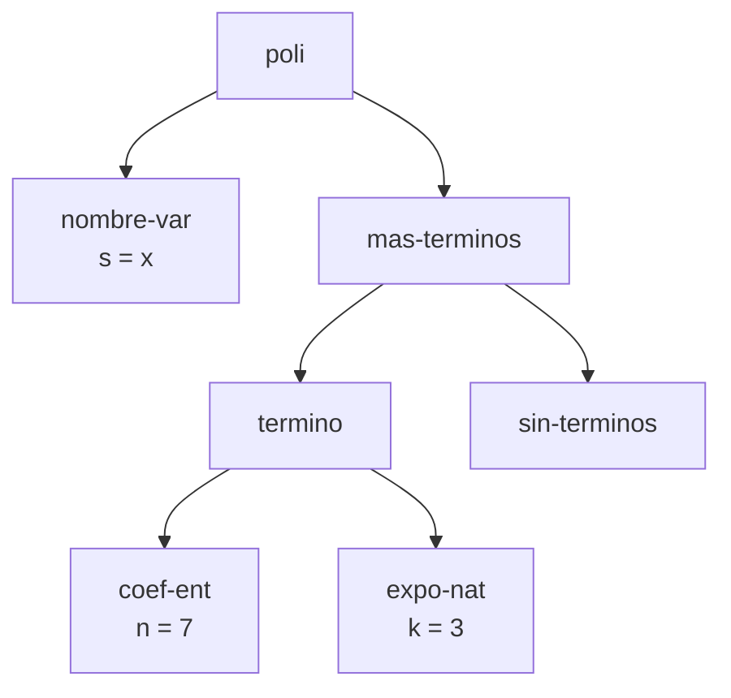
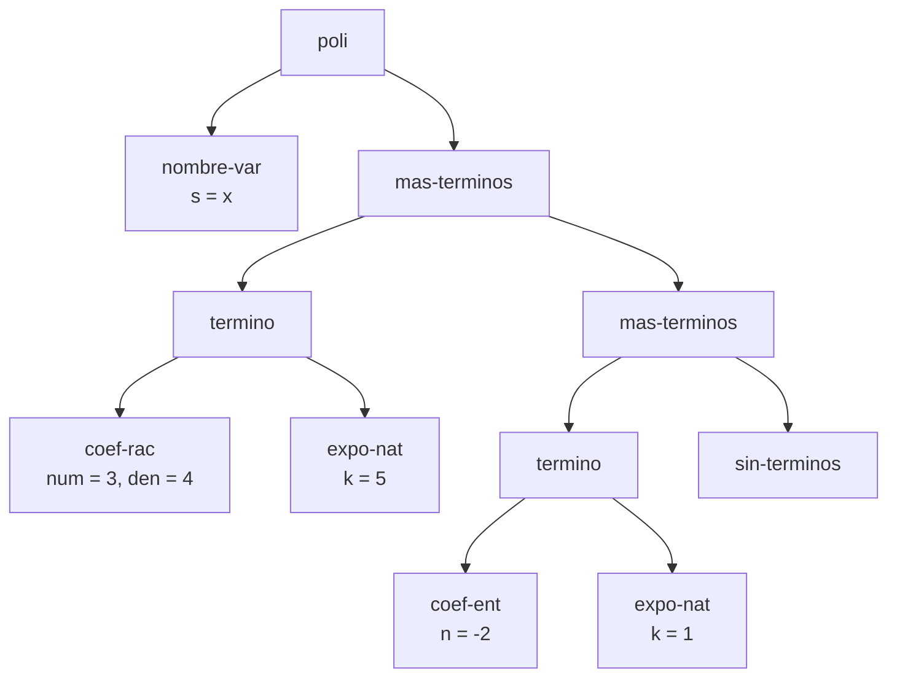
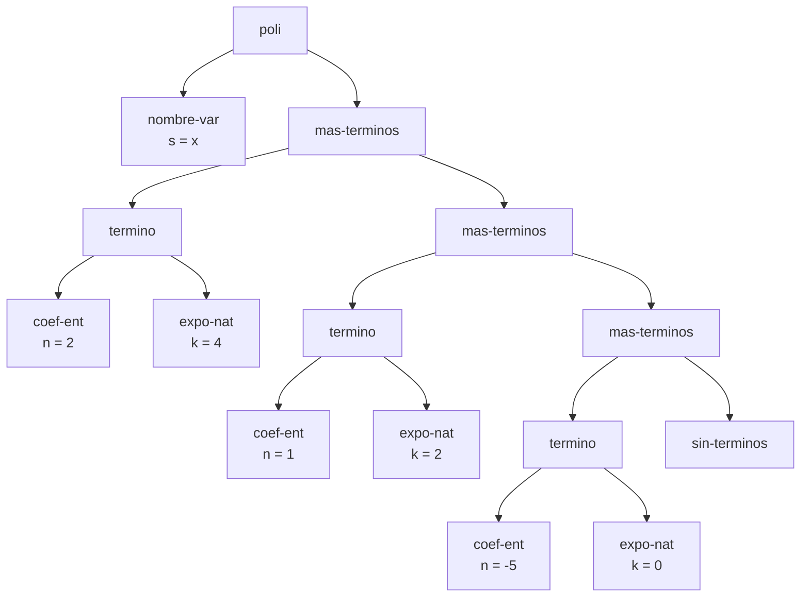
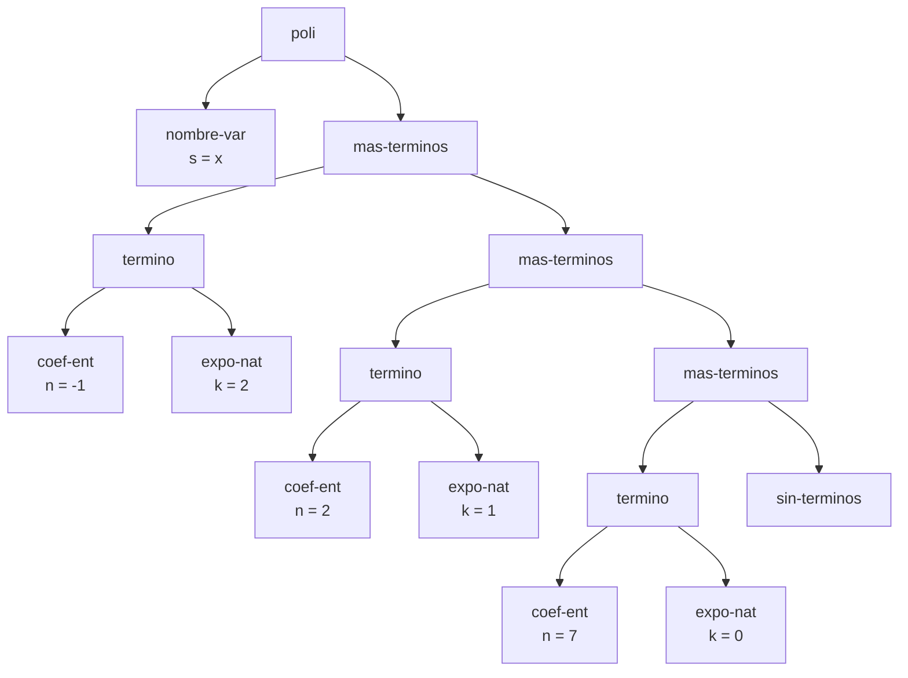

# Informe de AST — Taller 1: polinomios dispersos

Curso: Fundamentos de Interpretación y Compilación de Lenguajes de Programación — Universidad del Valle, Sede Tuluá.

Integrantes del grupo:

| Nombre | Código | Correo institucional |
| --- | --- | --- |
| Samuel Peña Jaramillo | 202477399 | {{samuel.pena@correounivalle.edu.co}} |
| Laura Sofía Echeverry González | 2477067 | {{echeverry.laura@correounivalle.edu.co}} |
| Santiago Serrano Morales | 202477006 | {{serrano.santiago@correounivalle.edu.co}} |
| Nicolas Cardona Garcia | 2477349-3743 | {{nicolas.cardona.garcia@correounivalle.edu.co}} |

## 1. Gramática considerada

Esta es la gramática del enunciado. Los nombres del recuadro son los constructores que deben aparecer como etiquetas en los diagramas de la sección 2.

```
<polinomio>   ::= <variable> <terminos>
                   poli(var, terms)

<variable>    ::= <symbol>
                   nombre-var(s)

<terminos>    ::= '()
                   sin-terminos()
              ::= <termino> <terminos>
                   mas-terminos(term, resto)

<termino>     ::= <coeficiente> <exponente>
                   termino(coef, expo)

<coeficiente> ::= <int>
                   coef-ent(n)
              ::= <int> "/" <int>
                   coef-rac(num, den)

<exponente>   ::= <int>
                   expo-nat(k)
```

Realización de cada no terminal con `define-datatype` (ver `polinomios-datatypes.rkt`):

| No terminal | Variantes del datatype | Campos |
| --- | --- | --- |
| `<polinomio>` | `poli` | `var : variable?`, `terms : terminos?` |
| `<variable>` | `nombre-var` | `s : symbol?` |
| `<terminos>` | `sin-terminos`, `mas-terminos` | `sin-terminos`: ninguno. `mas-terminos`: `term : termino?`, `resto : terminos?` |
| `<termino>` | `termino` (el tipo se llama `termino-tad` porque `define-datatype` no permite que el tipo y la variante compartan nombre) | `coef : coeficiente?`, `expo : exponente?` |
| `<coeficiente>` | `coef-ent`, `coef-rac` | `coef-ent`: `n : integer?`. `coef-rac`: `num : integer?`, `den : integer?` |
| `<exponente>` | `expo-nat` | `k : integer?` |

## 2. Ejemplos de AST

Los cuatro ejemplos que siguen son los que pide el enunciado. Cada uno lleva el polinomio escrito en notación matemática, el AST como diagrama Mermaid con los nombres de los constructores en los nodos, y una explicación breve.

El nodo del final de la lista de términos, `sin-terminos`, se dibuja siempre: es el caso base de la recursión y sin él el árbol queda incompleto.

### Ejemplo 1 — un solo término con coeficiente entero

Polinomio: $p_1 = 7x^3$

Construcción:

```racket
(poli (nombre-var 'x)
      (mas-terminos (termino (coef-ent 7) (expo-nat 3))
                     (sin-terminos)))
```

AST:


```mermaid
graph TD
    P1["poli"] --> V1["nombre-var<br/>s = x"]
    P1 --> T1["mas-terminos"]
    T1 --> TM1["termino"]
    T1 --> ST1["sin-terminos"]
    TM1 --> C1["coef-ent<br/>n = 7"]
    TM1 --> E1["expo-nat<br/>k = 3"]
```

Explicación: el nodo `poli` tiene siempre dos hijos: la variable (`nombre-var`) y la lista de términos. Como el polinomio tiene un solo término, `mas-terminos` guarda ese `termino` y cierra la lista con `sin-terminos` como segundo hijo, en vez de otro `mas-terminos`. Dentro de `termino`, el coeficiente y el exponente son subárboles separados porque la gramática los trata como categorías sintácticas distintas (`<coeficiente>` y `<exponente>`): el primero puede ramificarse en `coef-ent` o `coef-rac` según el caso, y el segundo es siempre `expo-nat`.

### Ejemplo 2 — dos términos, uno con coeficiente racional

Polinomio: $p_2 = \\dfrac{3}{4}x^5 - 2x$

Construcción:

```racket
(poli (nombre-var 'x)
      (mas-terminos (termino (coef-rac 3 4) (expo-nat 5))
                     (mas-terminos (termino (coef-ent -2) (expo-nat 1))
                                    (sin-terminos))))
```

AST:


```mermaid
graph TD
    P2["poli"] --> V2["nombre-var<br/>s = x"]
    P2 --> T2a["mas-terminos"]
    T2a --> TM2a["termino"]
    T2a --> T2b["mas-terminos"]
    TM2a --> C2a["coef-rac<br/>num = 3, den = 4"]
    TM2a --> E2a["expo-nat<br/>k = 5"]
    T2b --> TM2b["termino"]
    T2b --> ST2["sin-terminos"]
    TM2b --> C2b["coef-ent<br/>n = -2"]
    TM2b --> E2b["expo-nat<br/>k = 1"]
```

Explicación: la diferencia entre `coef-rac` y `coef-ent` está en los campos, no en la posición del nodo: `coef-rac` tiene dos hijos (`num`, `den`) porque la gramática lo define como `<int> "/" <int>`, mientras que `coef-ent` tiene un único hijo (`n`). El orden decreciente de exponentes que exige el invariante se ve en la forma del árbol: el primer `mas-terminos` (el más cercano a la raíz) siempre contiene el término de mayor exponente, y cada `mas-terminos` anidado hacia la derecha contiene exponentes estrictamente menores — aquí $5 > 1$, y por eso el término de $x^5$ aparece antes que el de $x^1$.

### Ejemplo 3 — tres o más términos, con término independiente

Polinomio: $p_3 = 2x^4 + x^2 - 5$

Construcción:

```racket
(poli (nombre-var 'x)
      (mas-terminos (termino (coef-ent 2) (expo-nat 4))
                     (mas-terminos (termino (coef-ent 1) (expo-nat 2))
                                    (mas-terminos (termino (coef-ent -5) (expo-nat 0))
                                                   (sin-terminos)))))
```

AST:


```mermaid
graph TD
    P3["poli"] --> V3["nombre-var<br/>s = x"]
    P3 --> T3a["mas-terminos"]
    T3a --> TM3a["termino"]
    T3a --> T3b["mas-terminos"]
    TM3a --> C3a["coef-ent<br/>n = 2"]
    TM3a --> E3a["expo-nat<br/>k = 4"]
    T3b --> TM3b["termino"]
    T3b --> T3c["mas-terminos"]
    TM3b --> C3b["coef-ent<br/>n = 1"]
    TM3b --> E3b["expo-nat<br/>k = 2"]
    T3c --> TM3c["termino"]
    T3c --> ST3["sin-terminos"]
    TM3c --> C3c["coef-ent<br/>n = -5"]
    TM3c --> E3c["expo-nat<br/>k = 0"]
```

Explicación: el término independiente ($-5$, sin variable visible) se representa exactamente igual que cualquier otro término: un nodo `termino` con su `coef-ent` y su `expo-nat`. Lo único particular es que su exponente vale $0$, pero sigue siendo un nodo `expo-nat` como los demás — la gramática no distingue un caso especial para el exponente cero, y el invariante solo exige que sea un entero no negativo. Por eso el término independiente aparece al final de la cadena de `mas-terminos`, justo antes de `sin-terminos`, porque $0$ es el menor de los tres exponentes.

### Ejemplo 4 — el resultado de `(sumar p q)`

Se usan los polinomios $p$ y $q$ del ejemplo de la Parte 3 del enunciado.

Operandos:

$$p = 4x^5 - \\frac{3}{2}x^2 + 7 \\qquad q = -4x^5 + \\frac{1}{2}x^2 + 2x$$

Resultado: $p + q = -x^2 + 2x + 7$

Construcción de los operandos:

```racket
(define p
  (poli (nombre-var 'x)
        (mas-terminos (termino (coef-ent 4) (expo-nat 5))
                       (mas-terminos (termino (coef-rac -3 2) (expo-nat 2))
                                      (mas-terminos (termino (coef-ent 7) (expo-nat 0))
                                                     (sin-terminos))))))

(define q
  (poli (nombre-var 'x)
        (mas-terminos (termino (coef-ent -4) (expo-nat 5))
                       (mas-terminos (termino (coef-rac 1 2) (expo-nat 2))
                                      (mas-terminos (termino (coef-ent 2) (expo-nat 1))
                                                     (sin-terminos))))))
```

Construcción del resultado `(sumar p q)`:

```racket
(poli (nombre-var 'x)
      (mas-terminos (termino (coef-ent -1) (expo-nat 2))
                     (mas-terminos (termino (coef-ent 2) (expo-nat 1))
                                    (mas-terminos (termino (coef-ent 7) (expo-nat 0))
                                                   (sin-terminos)))))
```

AST del resultado:


```mermaid
graph TD
    PR["poli"] --> VR["nombre-var<br/>s = x"]
    PR --> TRa["mas-terminos"]
    TRa --> TMRa["termino"]
    TRa --> TRb["mas-terminos"]
    TMRa --> CRa["coef-ent<br/>n = -1"]
    TMRa --> ERa["expo-nat<br/>k = 2"]
    TRb --> TMRb["termino"]
    TRb --> TRc["mas-terminos"]
    TMRb --> CRb["coef-ent<br/>n = 2"]
    TMRb --> ERb["expo-nat<br/>k = 1"]
    TRc --> TMRc["termino"]
    TRc --> STR["sin-terminos"]
    TMRc --> CRc["coef-ent<br/>n = 7"]
    TMRc --> ERc["expo-nat<br/>k = 0"]
```

Origen de cada nodo:

| Término del resultado | Viene de | Observación |
| --- | --- | --- |
| $-x^2$ (coef $-1$, exp $2$) | suma de ambos | $p$ tenía $-\\frac{3}{2}x^2$ y $q$ tenía $\\frac{1}{2}x^2$ en el mismo exponente; `sumar-terminos` combina ambos coeficientes: $-\\frac{3}{2}+\\frac{1}{2}=-1$. |
| $2x$ (coef $2$, exp $1$) | $q$ | $p$ no tiene término con exponente $1$, así que el término de $q$ pasa sin cambios al resultado. |
| $7$ (coef $7$, exp $0$) | $p$ | $q$ no tiene término con exponente $0$, así que el término de $p$ pasa sin cambios al resultado. |

Términos cancelados: el término de exponente $5$ se anula por completo. $p$ aportaba $4x^5$ y $q$ aportaba $-4x^5$; como ambos tienen el mismo exponente, `sumar-terminos` suma sus coeficientes ($4 + (-4) = 0$) y, al dar cero, el invariante (condición "sin ceros") exige que ese término no aparezca en el resultado. Por eso no hay ningún nodo de exponente $5$ en el AST de `(sumar p q)`.

## 3. Referencias

- Friedman, D. P., & Wand, M. *Essentials of Programming Languages*, 3.ª ed., MIT Press, 2008. Sección 2.1 (especificación de datos), sección 2.2 (representaciones de un TAD), sección 2.4 (`define-datatype` y `cases`).
- The Racket Reference, *Numbers*: [https://docs.racket-lang.org/reference/numbers.html](https://docs.racket-lang.org/reference/numbers.html).